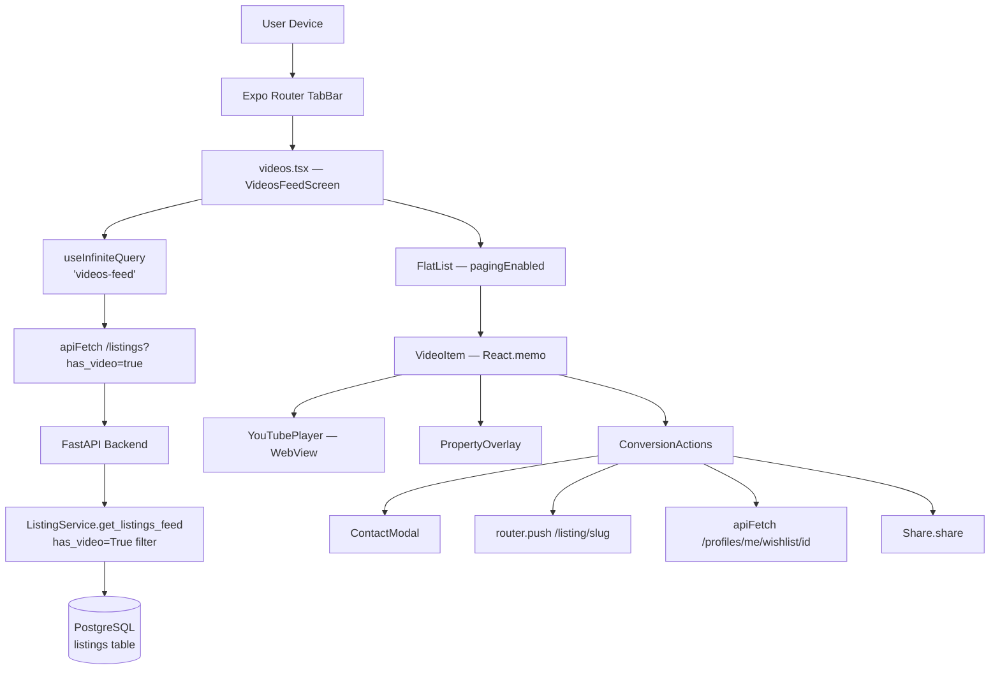
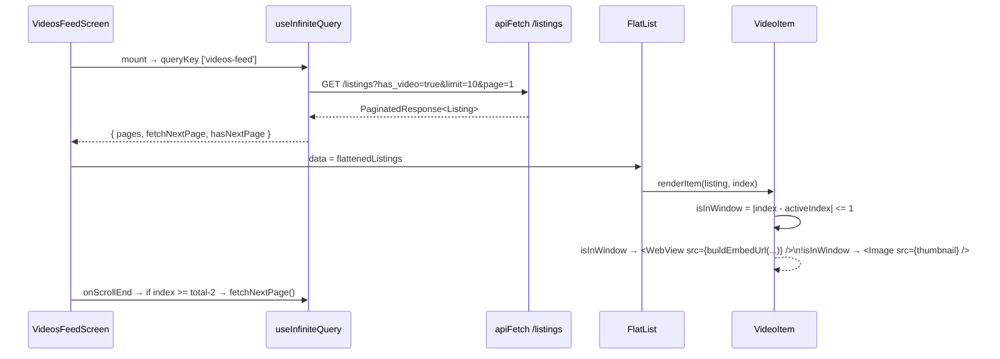

# Design Document: Videos Feed

## Overview

The Videos Feed adds a new `/videos` tab to the Rumia mobile app — a full-screen, vertically snapping short-form property discovery experience modelled on TikTok/Instagram Reels. The feature reuses the existing `/listings` endpoint (extended with a `has_video` filter), the `Listing` schema, the `ContactModal`, wishlist/save API, `Share`, and all existing design tokens. No new tables or video hosting infrastructure are required.

The screen is a file-based Expo Router route at `mobile/app/(tabs)/videos.tsx`, making it a direct tab peer of Home, Search, Verify, and Account. One new npm dependency is required: `react-native-webview` for YouTube IFrame embedding.

### Key Design Decisions

- **Reuse, not reimplementation.** Every API call, auth gate, contact flow, and save flow is taken verbatim from patterns already used in `mobile/app/listing/[slug].tsx` and `mobile/app/(tabs)/saved.tsx`.
- **3-player windowing.** Only the active item ±1 adjacent item have a WebView mounted. All others render a static thumbnail. This caps WebView instances at 3 regardless of feed length, protecting older Android devices.
- **URL-driven playback control.** Playback state (autoplay/mute) is controlled entirely through the YouTube IFrame embed URL, not through WebView injection or `postMessage`. This eliminates cross-origin scripting concerns and keeps the YouTube player self-contained.
- **FlatList with `pagingEnabled`.** One item per screen, fixed height via `getItemLayout`, `windowSize=3`, `initialNumToRender=1`. No gesture libraries or `react-native-reanimated` shared values inside `renderItem`.
- **`useInfiniteQuery` for pagination.** Consistent with future pagination needs; exposes `fetchNextPage`, `hasNextPage`, and `isFetchingNextPage` natively.

---

## Architecture

### System Context Diagram



### Component Tree

```
VideosFeedScreen (videos.tsx)
├── Stack.Screen (title="Property Videos · Rumia")
├── FlatList<Listing>
│   └── VideoItem (React.memo)                 ← rendered per item
│       ├── YouTubePlayer (WebView | Thumbnail)  ← active ±1 → WebView, else → Image
│       ├── PropertyOverlay
│       │   ├── GradientOverlay (LinearGradient)
│       │   ├── PropertyTypeBadge
│       │   ├── ListingTitle
│       │   ├── PriceLabel
│       │   ├── LocationLabel
│       │   └── FullyOccupiedBadge (conditional)
│       └── ConversionActions (right-side icon column)
│           ├── ViewListingButton
│           ├── ContactButton
│           ├── SaveButton (heart)
│           └── ShareButton
├── EmptyState (when items.length === 0)
├── Skeleton (while loading)
└── ContactModal (shared, hoisted to screen root)
```

### Data Flow



---

## Components and Interfaces

### VideosFeedScreen (`mobile/app/(tabs)/videos.tsx`)

Top-level screen. Owns all shared mutable state, the query, and the ContactModal.

```typescript
// Key state
const [activeIndex, setActiveIndex] = useState(0);
const [isMuted, setIsMuted] = useState(false);
const [contactListing, setContactListing] = useState<Listing | null>(null);

// Data
const {
  data,
  isLoading,
  isError,
  refetch,
  fetchNextPage,
  hasNextPage,
} = useInfiniteQuery<ListingsPage>({
  queryKey: ['videos-feed'],
  queryFn: ({ pageParam = 1 }) =>
    apiFetch('/listings', {
      params: { has_video: true, limit: 10, page: pageParam as number },
    }),
  getNextPageParam: (lastPage) =>
    lastPage.page < lastPage.pages ? lastPage.page + 1 : undefined,
  initialPageParam: 1,
});

const listings: Listing[] = useMemo(
  () => data?.pages.flatMap((p) => p.items) ?? [],
  [data],
);

// Scroll handler
const onViewableItemsChanged = useRef(
  ({ viewableItems }: { viewableItems: ViewToken[] }) => {
    const first = viewableItems[0];
    if (first != null) {
      const idx = first.index ?? 0;
      setActiveIndex(idx);
      // Pagination trigger: within 2 of end
      if (idx >= listings.length - 2 && hasNextPage) {
        fetchNextPage();
      }
      // Analytics
      const listing = listings[idx];
      if (listing) {
        posthog.capture('video_item_viewed', {
          listing_id: listing.id,
          property_type: listing.property_type,
          youtube_id: listing.youtube_id,
        });
      }
    }
  }
).current;
```

**FlatList configuration:**

```typescript
<FlatList
  data={listings}
  keyExtractor={(item) => item.id}
  renderItem={({ item, index }) => (
    <VideoItem
      listing={item}
      index={index}
      activeIndex={activeIndex}
      isMuted={isMuted}
      onToggleMute={() => setIsMuted((m) => !m)}
      onContact={() => setContactListing(item)}
    />
  )}
  pagingEnabled
  decelerationRate="fast"
  showsVerticalScrollIndicator={false}
  removeClippedSubviews
  initialNumToRender={1}
  windowSize={3}
  getItemLayout={(_data, index) => ({
    length: windowHeight,
    offset: windowHeight * index,
    index,
  })}
  onViewableItemsChanged={onViewableItemsChanged}
  viewabilityConfig={{ itemVisiblePercentThreshold: 50 }}
  ListEmptyComponent={<VideosEmptyState />}
  ListFooterComponent={
    !hasNextPage && listings.length > 0 ? <EndOfFeedIndicator /> : null
  }
/>
```

### VideoItem (`mobile/features/videos/video-item.tsx`)

Wrapped in `React.memo`. Decides whether to mount a WebView or static thumbnail based on the windowing rule `|index - activeIndex| <= 1`.

```typescript
interface VideoItemProps {
  listing: Listing;
  index: number;
  activeIndex: number;
  isMuted: boolean;
  onToggleMute: () => void;
  onContact: () => void;
}

const VideoItem = React.memo(function VideoItem({
  listing,
  index,
  activeIndex,
  isMuted,
  onToggleMute,
  onContact,
}: VideoItemProps) {
  const { height: windowHeight } = useWindowDimensions();
  const isActive = index === activeIndex;
  const isInWindow = Math.abs(index - activeIndex) <= 1;

  return (
    <View style={{ height: windowHeight, width: '100%' }}>
      {isInWindow ? (
        <YouTubePlayer
          youtubeId={listing.youtube_id!}
          isActive={isActive}
          isMuted={isMuted}
        />
      ) : (
        <ThumbnailFallback listing={listing} />
      )}
      <PropertyOverlay
        listing={listing}
        isMuted={isMuted}
        onToggleMute={onToggleMute}
      />
      <ConversionActions
        listing={listing}
        onContact={onContact}
      />
    </View>
  );
});
```

### YouTubePlayer (`mobile/features/videos/youtube-player.tsx`)

Renders a `react-native-webview` WebView with a YouTube IFrame embed URL.

```typescript
interface YouTubePlayerProps {
  youtubeId: string;
  isActive: boolean;
  isMuted: boolean;
}

function YouTubePlayer({ youtubeId, isActive, isMuted }: YouTubePlayerProps) {
  const [hasError, setHasError] = useState(false);
  const { height: windowHeight } = useWindowDimensions();

  const uri = buildYouTubeEmbedUrl(youtubeId, { isActive, isMuted });

  if (hasError) {
    return <ThumbnailFallbackView youtubeId={youtubeId} />;
  }

  return (
    <WebView
      source={{ uri }}
      style={{ flex: 1, height: windowHeight }}
      allowsInlineMediaPlayback
      mediaPlaybackRequiresUserAction={false}
      onError={() => setHasError(true)}
      onHttpError={() => setHasError(true)}
      scrollEnabled={false}
      bounces={false}
      allowsFullscreenVideo={false}
    />
  );
}
```

### PropertyOverlay (`mobile/features/videos/property-overlay.tsx`)

Renders property metadata over the video using a bottom gradient. Includes the mute toggle.

```typescript
interface PropertyOverlayProps {
  listing: Listing;
  isMuted: boolean;
  onToggleMute: () => void;
}
```

Layout: `position: 'absolute'`, `bottom: 0`, `left: 0`, `right: 0`, gradient from `rgba(0,0,0,0.7)` at the bottom to `transparent` at 50% of item height.

### ConversionActions (`mobile/features/videos/conversion-actions.tsx`)

Vertical icon column on the right side of the item. Handles navigation, save mutation, and share.

```typescript
interface ConversionActionsProps {
  listing: Listing;
  onContact: () => void;
}
```

Internally uses `useMutation` for save/unsave, reads `useSessionStore` for auth gating, calls `useRouter` for navigation.

---

## Data Models

### Relevant Listing Fields

The screen uses the existing `ListingRead` schema from `mobile/lib/api/schema.ts` (backed by `components['schemas']['ListingRead']` in `types.ts`). No new schema fields are required. Key fields consumed by the Videos Feed:

| Field | Type | Usage |
|---|---|---|
| `id` | `string` | `keyExtractor`, wishlist API path |
| `slug` | `string` | Navigation to `/listing/[slug]` |
| `title` | `string` | PropertyOverlay title |
| `price` | `number` | Price display |
| `location` | `string` | Location label |
| `area` | `string \| null` | Area label (omitted if null) |
| `property_type` | `'hostel' \| 'apartment' \| 'short_stay'` | Badge, price unit |
| `youtube_id` | `string \| null` | WebView embed URL |
| `is_youtube_shorts` | `boolean` | Embed URL format |
| `is_active` | `boolean` | Feed filter (backend) |
| `is_saved` | `boolean` | Heart icon fill state |
| `is_full` | `boolean` | "Fully Occupied" badge |
| `images` | `ListingImage[]` | Thumbnail fallback |
| `agent` | `Agent \| null` | ContactModal data |

### API Request Shape

```typescript
// Infinite query page fetch
apiFetch<ListingsPage>('/listings', {
  params: {
    has_video: true,
    limit: 10,
    page: pageParam,       // 1-based
  },
})

// Save listing
apiFetch(`/profiles/me/wishlist/${listing.id}`, { method: 'POST' })
apiFetch(`/profiles/me/wishlist/${listing.id}`, { method: 'DELETE' })
```

### Backend: `has_video` Filter

#### `router.py` addition

```python
# Add to get_listings() query params:
has_video: Optional[bool] = Query(None, description="Filter to listings with a YouTube video (youtube_id IS NOT NULL)")

# Pass to service:
listings, total, view_counts = await ListingService.get_listings_feed(
    ...
    has_video=has_video,
)
```

#### `service.py` addition

```python
# Add parameter to get_listings_feed():
has_video: Optional[bool] = None,

# Add filter after existing property_type filter:
if has_video is True:
    stmt = stmt.where(Listing.youtube_id.is_not(None))
elif has_video is False:
    stmt = stmt.where(Listing.youtube_id.is_(None))
```

This follows the identical pattern used by the `property_type` filter already in the service.

---

## Key Function Signatures

### `buildYouTubeEmbedUrl`

Pure function in `mobile/features/videos/youtube-player.tsx`. This is the heart of playback control.

```typescript
interface EmbedOptions {
  isActive: boolean;
  isMuted: boolean;
}

/**
 * Builds a YouTube IFrame embed URL with playback parameters.
 *
 * Parameters:
 *   autoplay=1  when active, 0 when inactive
 *   mute=1      when muted (also required for autoplay on some Android WebViews)
 *   controls=1  show native YT controls
 *   rel=0       no related videos at end
 *   modestbranding=1  minimal YouTube chrome
 *   playsinline=1     required for iOS inline playback
 *
 * The URL always uses the standard embed path regardless of is_youtube_shorts
 * because the YouTube IFrame API treats Shorts and regular videos identically
 * when using the /embed/ path.
 */
export function buildYouTubeEmbedUrl(
  youtubeId: string,
  options: EmbedOptions,
): string {
  const params = new URLSearchParams({
    autoplay: options.isActive ? '1' : '0',
    mute: options.isMuted || !options.isActive ? '1' : '0',
    controls: '1',
    rel: '0',
    modestbranding: '1',
    playsinline: '1',
  });
  return `https://www.youtube.com/embed/${youtubeId}?${params.toString()}`;
}
```

> **Note on mute strategy:** When `isActive=true` and `isMuted=false`, `mute=0` is used — the video plays with sound. When `isActive=false`, `mute=1` is always set regardless of session mute state, to silence any already-loaded WebView that is scrolling out of view.

### `getPriceLabel`

Pure function for price display in `PropertyOverlay`.

```typescript
export function getPriceLabel(
  propertyType: string,
  price: number,
): string {
  const formattedPrice = `KES ${price.toLocaleString()}`;
  if (propertyType === 'short_stay') {
    return `${formattedPrice}/night`;
  }
  return `${formattedPrice}/mo`;
}
```

### `getPropertyTypeBadge`

Pure function for badge config.

```typescript
interface BadgeConfig {
  label: string;
  color: string;
}

export function getPropertyTypeBadge(propertyType: string): BadgeConfig {
  switch (propertyType) {
    case 'hostel':
      return { label: 'Hostel', color: palette.emerald[600] };
    case 'apartment':
      return { label: 'Apartment', color: palette.sky[600] };
    case 'short_stay':
      return { label: 'Short Stay', color: palette.amber[500] };
    default:
      return { label: propertyType, color: palette.slate[500] };
  }
}
```

### `getSaveMethod`

```typescript
export function getSaveMethod(isSaved: boolean): 'POST' | 'DELETE' {
  return isSaved ? 'DELETE' : 'POST';
}
```

### Save/Unsave Mutation (inside `ConversionActions`)

```typescript
const queryClient = useQueryClient();
const isAuthenticated = useSessionStore((s) => s.isAuthenticated);
const router = useRouter();

const saveMutation = useMutation({
  mutationFn: () =>
    apiFetch(`/profiles/me/wishlist/${listing.id}`, {
      method: getSaveMethod(listing.is_saved),
    }),
  onSuccess: () => {
    queryClient.invalidateQueries({ queryKey: ['videos-feed'] });
    queryClient.invalidateQueries({ queryKey: ['wishlist'] });
  },
});

const handleSave = () => {
  if (!isAuthenticated) {
    router.push('/(auth)/login');
    return;
  }
  saveMutation.mutate();
};
```

### Share Handler (inside `ConversionActions`)

```typescript
const handleShare = async () => {
  const priceUnit = listing.property_type === 'short_stay' ? '/night' : '/mo';
  await Share.share({
    message: `${listing.title} — KES ${listing.price.toLocaleString()}${priceUnit} · ${listing.location}`,
  });
};
```

---

## Tab Navigation Integration

### `_layout.tsx` change

Add `Play` from `lucide-react-native` to the imports, then add a Videos entry to the `TABS` array as the third position (center):

```typescript
import { Home, Play, Search, ShieldCheck, User } from 'lucide-react-native';

const TABS: TabConfig[] = [
  { name: 'index',   label: 'Home',    icon: Home },
  { name: 'explore', label: 'Search',  icon: Search },
  { name: 'videos',  label: 'Videos',  icon: Play },     // ← NEW (center)
  { name: 'verify',  label: 'Verify',  icon: ShieldCheck },
  { name: 'profile', label: 'Account', icon: User },
];
```

The `renderTabIcon` helper and `Tabs.Screen` mapping loop are unchanged — the Videos tab inherits the same `strokeWidth`/`fill` focused/unfocused behavior as all other tabs.

---

## File Structure

All new files required:

```
mobile/
  app/
    (tabs)/
      videos.tsx                          ← NEW: screen entry point, FlatList, query, ContactModal
  features/
    videos/
      video-item.tsx                      ← NEW: React.memo VideoItem component
      youtube-player.tsx                  ← NEW: WebView wrapper + buildYouTubeEmbedUrl
      property-overlay.tsx                ← NEW: gradient overlay with property info + mute toggle
      conversion-actions.tsx              ← NEW: right-side icon column (View/Contact/Save/Share)
      videos-empty-state.tsx              ← NEW: EmptyState wrapper for videos context
      __tests__/
        youtube-player.test.ts            ← NEW: unit + property tests for URL builder
        property-overlay.test.ts          ← NEW: unit tests for badge/price helpers
        conversion-actions.test.ts        ← NEW: save toggle, auth gate tests
        videos-feed.test.ts               ← NEW: windowing, pagination trigger tests

backend/
  app/
    features/
      listings/
        router.py                         ← MODIFIED: add has_video query param
        service.py                        ← MODIFIED: add has_video filter to get_listings_feed
```

No changes to `mobile/app/_layout.tsx` (the root Stack) are required. The `(tabs)` group auto-registers `videos.tsx`.

---

## Correctness Properties

*A property is a characteristic or behavior that should hold true across all valid executions of a system — essentially, a formal statement about what the system should do. Properties serve as the bridge between human-readable specifications and machine-verifiable correctness guarantees.*

### Property 1: Video filter — only valid video listings displayed

*For any* array of listings with mixed `youtube_id` values (null and non-null) and mixed `is_active` values, the filter function applied before rendering SHALL return only listings where both `youtube_id` is non-null AND `is_active` is `true`.

**Validates: Requirements 1.2**

---

### Property 2: Windowing — at most 3 players mounted at any time

*For any* active index and *for any* list length, the set of indices that satisfy the "in-window" condition (`|index - activeIndex| <= 1`) SHALL have a size of at most 3. No index outside that window SHALL have a WebView mounted.

**Validates: Requirements 2.3, 2.4, 12.1**

---

### Property 3: Pagination trigger — next page fetched when near end

*For any* list of N items, when `activeIndex >= N - 2` and `hasNextPage` is `true`, the `fetchNextPage` function SHALL be called. When `activeIndex < N - 2`, `fetchNextPage` SHALL NOT be called.

**Validates: Requirements 2.2**

---

### Property 4: Viewport height — each item fills the screen

*For any* device viewport height H reported by `useWindowDimensions()`, each `VideoItem` SHALL render with an explicit `height` equal to H, never a hardcoded value.

**Validates: Requirements 3.2, 13.3**

---

### Property 5: YouTube embed URL contains the correct video ID

*For any* non-empty `youtubeId` string, `buildYouTubeEmbedUrl(youtubeId, options)` SHALL return a URL string that contains `youtubeId` as a path segment in the form `/embed/{youtubeId}`.

**Validates: Requirements 4.1, 4.2**

---

### Property 6: Embed URL autoplay and mute parameters are correct

*For any* `youtubeId`, `isActive` boolean, and `isMuted` boolean, `buildYouTubeEmbedUrl` SHALL:
- Include `autoplay=1` when `isActive=true`, and `autoplay=0` when `isActive=false`
- Include `mute=1` when `isMuted=true` OR `isActive=false`, and `mute=0` only when `isMuted=false` AND `isActive=true`

**Validates: Requirements 4.3, 4.4, 4.5**

---

### Property 7: Price label matches property type

*For any* `property_type` value and *for any* price amount, `getPriceLabel(property_type, price)` SHALL return a string ending in `/night` when `property_type === 'short_stay'`, and ending in `/mo` for all other property types.

**Validates: Requirements 5.3, 7.1, 7.2, 7.3**

---

### Property 8: Property type badge label and color are consistent

*For any* `property_type` value in `{ 'hostel', 'apartment', 'short_stay' }`, `getPropertyTypeBadge(property_type)` SHALL return the correct label and color token: `'Hostel'`/`emerald[600]`, `'Apartment'`/`sky[600]`, `'Short Stay'`/`amber[500]`.

**Validates: Requirements 5.4, 7.1, 7.2, 7.3**

---

### Property 9: Null listing fields are excluded from overlay rendering

*For any* listing object where `area` is `null` and/or `distance_to_campus` is `null`, the rendered `PropertyOverlay` output SHALL NOT contain text representing those null fields.

**Validates: Requirements 7.4**

---

### Property 10: Save toggle uses correct HTTP method

*For any* listing, `getSaveMethod(listing.is_saved)` SHALL return `'DELETE'` when `is_saved=true` and `'POST'` when `is_saved=false`. The save mutation SHALL call `apiFetch` with the method returned by this function.

**Validates: Requirements 6.4, 6.7**

---

### Property 11: Auth gate — unauthenticated save navigates to login

*For any* listing, when `isAuthenticated=false`, calling the save handler SHALL navigate to `/(auth)/login` and SHALL NOT call `apiFetch` for the wishlist endpoint.

**Validates: Requirements 6.5, 11.2**

---

### Property 12: Backend `has_video` filter — only listings with youtube_id returned

*For any* collection of `Listing` database rows with mixed `youtube_id` values, when `get_listings_feed` is called with `has_video=True`, the returned listings SHALL contain only rows where `youtube_id IS NOT NULL`. When called with `has_video=False` or `has_video=None`, the filter SHALL NOT be applied to `youtube_id`.

**Validates: Requirements 15.2, 15.3, 1.1**

---

## Error Handling

### WebView Player Failure

Each `YouTubePlayer` maintains a local `hasError` boolean state. On WebView `onError` or `onHttpError`, `hasError` is set to `true` and the component renders `ThumbnailFallback` instead. The fallback uses `listing.images[0]?.r2_url` if available, or a Rumia branded placeholder. The `PropertyOverlay` and `ConversionActions` remain mounted and functional — the listing is still actionable.

### API Fetch Failure

`useInfiniteQuery` captures the error in its `isError` and `error` state. When `isError=true` and `listings.length === 0`, the screen renders a full-screen error component with a "Try again" button wired to `refetch()`. When the error occurs on a subsequent page fetch (pagination), the existing items remain visible and a toast/snack is shown at the bottom.

### Invalid `youtube_id`

If `listing.youtube_id` is present but is an empty string or clearly not a YouTube ID (no `/embed/` URL can be formed), `buildYouTubeEmbedUrl` returns a URL that will immediately trigger `onHttpError` on the WebView, which is caught by the `hasError` handler above.

### Null Agent

`ContactModal` already handles the "no contact number" case with an `Alert.alert` — when `listing.agent` is null, both `agentPhone` and `landlordPhone` will be empty strings, and the modal displays its existing "No contact number" alert. No additional handling in the Videos Feed is required.

### React Error Boundary

`VideosFeedScreen` wraps its FlatList content in a class-based or `react-error-boundary` `ErrorBoundary`. A render error in one `VideoItem` is caught, that item renders an error card, and the rest of the feed continues functioning.

---

## Testing Strategy

### Unit Tests (example-based)

Specific scenarios tested with concrete examples:

- **Empty state rendering**: when `listings.length === 0`, `EmptyState` is displayed with correct title, subtitle, and action button
- **Loading state**: while `isLoading=true`, `Skeleton` component is displayed full-screen
- **End-of-feed indicator**: when `hasNextPage=false` and `listings.length > 0`, footer indicator renders
- **WebView error fallback**: `YouTubePlayer` renders `ThumbnailFallback` after `onError` fires
- **Full listing badge**: when `listing.is_full=true`, "Fully Occupied" pill is visible in overlay
- **Contact button with null agent**: ContactModal opens and shows "No contact number" alert
- **Unauthenticated View Listing navigation**: tapping "View Listing" navigates to `/listing/[slug]` without auth
- **Backend `has_video=false` pass-through**: existing callers that don't pass `has_video` get unchanged results

### Property-Based Tests

The property tests below validate universal correctness properties using the [fast-check](https://github.com/dubzzz/fast-check) library (already a common choice for TypeScript/React Native projects). Each test runs a minimum of 100 iterations.

Property tests target pure functions and pure logic extracted from components:

```typescript
// Tag format: Feature: videos-feed, Property {N}: {property_text}

// Property 1 — video filter
fc.assert(fc.property(fc.array(arbitraryListing()), (listings) => {
  const filtered = filterVideoListings(listings);
  return filtered.every(l => l.youtube_id != null && l.is_active === true);
}));
// Feature: videos-feed, Property 1: video filter — only valid video listings displayed

// Property 2 — windowing
fc.assert(fc.property(fc.nat(), fc.nat(), (activeIndex, listLength) => {
  const window = getWindowedIndices(activeIndex, listLength);
  return window.length <= 3;
}));
// Feature: videos-feed, Property 2: windowing — at most 3 players mounted at any time

// Property 3 — pagination trigger
fc.assert(fc.property(fc.nat({ max: 100 }), fc.boolean(), (activeIndex, hasNextPage) => {
  const listLength = activeIndex + 5; // always valid
  const shouldTrigger = activeIndex >= listLength - 2 && hasNextPage;
  return shouldTriggerFetchNextPage(activeIndex, listLength, hasNextPage) === shouldTrigger;
}));
// Feature: videos-feed, Property 3: pagination trigger — next page fetched when near end

// Property 4 — viewport height
fc.assert(fc.property(fc.integer({ min: 400, max: 1600 }), (windowHeight) => {
  const style = getVideoItemStyle(windowHeight);
  return style.height === windowHeight;
}));
// Feature: videos-feed, Property 4: viewport height — each item fills the screen

// Property 5 — embed URL contains ID
fc.assert(fc.property(arbitraryYouTubeId(), fc.boolean(), fc.boolean(), (id, isActive, isMuted) => {
  const url = buildYouTubeEmbedUrl(id, { isActive, isMuted });
  return url.includes(`/embed/${id}`);
}));
// Feature: videos-feed, Property 5: YouTube embed URL contains the correct video ID

// Property 6 — embed URL autoplay/mute params
fc.assert(fc.property(arbitraryYouTubeId(), fc.boolean(), fc.boolean(), (id, isActive, isMuted) => {
  const url = buildYouTubeEmbedUrl(id, { isActive, isMuted });
  const params = new URL(url).searchParams;
  const autoplayOk = isActive ? params.get('autoplay') === '1' : params.get('autoplay') === '0';
  const muteOk = (!isActive || isMuted) ? params.get('mute') === '1' : params.get('mute') === '0';
  return autoplayOk && muteOk;
}));
// Feature: videos-feed, Property 6: embed URL autoplay and mute parameters are correct

// Property 7 — price label
fc.assert(fc.property(fc.constantFrom('hostel', 'apartment', 'short_stay'), fc.nat(), (type, price) => {
  const label = getPriceLabel(type, price);
  if (type === 'short_stay') return label.endsWith('/night');
  return label.endsWith('/mo');
}));
// Feature: videos-feed, Property 7: price label matches property type

// Property 8 — badge config
fc.assert(fc.property(fc.constantFrom('hostel', 'apartment', 'short_stay'), (type) => {
  const badge = getPropertyTypeBadge(type);
  const expected = { hostel: 'Hostel', apartment: 'Apartment', short_stay: 'Short Stay' };
  return badge.label === expected[type as keyof typeof expected];
}));
// Feature: videos-feed, Property 8: property type badge label and color are consistent

// Property 9 — null fields excluded
fc.assert(fc.property(arbitraryListingWithNullFields(), (listing) => {
  const rendered = renderPropertyOverlayText(listing);
  if (listing.area == null) return !rendered.includes('area:');
  if (listing.distance_to_campus == null) return !rendered.includes('distance_to_campus:');
  return true;
}));
// Feature: videos-feed, Property 9: null listing fields are excluded from overlay rendering

// Property 10 — save toggle method
fc.assert(fc.property(fc.boolean(), (isSaved) => {
  const method = getSaveMethod(isSaved);
  return isSaved ? method === 'DELETE' : method === 'POST';
}));
// Feature: videos-feed, Property 10: save toggle uses correct HTTP method

// Property 12 — backend has_video filter (Python: hypothesis)
# @given(st.lists(listing_strategy()))
# def test_has_video_filter(listings):
#     session = create_test_session(listings)
#     results = sync(ListingService.get_listings_feed(session, has_video=True, ...))
#     assert all(l.youtube_id is not None for l in results)
// Feature: videos-feed, Property 12: backend has_video filter — only listings with youtube_id returned
```

### Integration Tests

- End-to-end fetch: `GET /listings?has_video=true` returns only listings where `youtube_id IS NOT NULL`
- Pagination: second page request with `page=2` returns a different set of listings
- Save/unsave: POST then DELETE round-trip leaves `is_saved` state consistent
- Analytics: PostHog events `videos_feed_viewed` and `video_item_viewed` are fired with correct properties

### Performance Validation (manual)

- Profile FlatList on a mid-range Android device (Pixel 4a equivalent) to verify no dropped frames during scroll
- Verify memory footprint with 3+ WebViews mounted does not exceed 150MB RSS on Android
